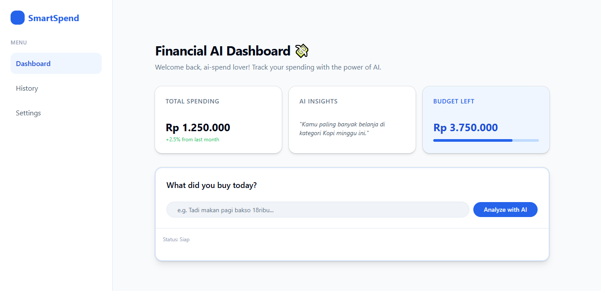

# SmartSpend 💸

> AI-powered personal finance tracker — type your expenses in plain language, let the AI handle the rest.

**Live Demo → [ai-spend-five.vercel.app](https://ai-spend-five.vercel.app)**

---



---

## Why I Built This

Tracking expenses is boring because the data entry part is tedious. I wanted to build something where you just *talk* to the app — "Tadi makan soto 25rb sama parkir 2rb" — and it automatically understands, categorizes, and logs everything. No forms, no dropdowns, just natural language.

This project also became my way of re-entering the software engineering world after a career break, and a hands-on playground for learning real AI integration with modern web tooling.

---

## Features

- **Natural language input** — type expenses the way you'd text a friend
- **AI-powered extraction** — converts free text into structured transaction data (item, cost, category) in real time
- **Streaming UI** — responses stream instantly using Vercel AI SDK, no loading spinners
- **Fintech-style dashboard** — total spending, AI insights, and budget overview at a glance
- **Responsive layout** — works on mobile and desktop

> 🚧 **In Progress:** Data persistence (Supabase), spending charts (Recharts), and budget alerts are currently in development.

---

## Tech Stack

| Layer | Tech |
|---|---|
| Framework | Next.js 15 (App Router) |
| Language | TypeScript |
| Styling | Tailwind CSS + Shadcn/ui + Radix UI |
| AI SDK | Vercel AI SDK (`@ai-sdk/react`) |
| LLM | Groq Cloud API — Llama 3.3 70B Versatile |
| Deployment | Vercel |

---

## Technical Choices

**Why Next.js App Router?**
Server Components and Route Handlers let me keep AI API calls server-side, so API keys never reach the client. The streaming support also pairs naturally with Vercel AI SDK's `useCompletion` hooks.

**Why Groq instead of OpenAI?**
Groq's inference speed on Llama 3.3 70B is significantly faster than standard OpenAI endpoints for this kind of structured extraction task, and the free tier is generous enough for a personal project.

**Why Shadcn/ui?**
Copy-paste components that I own — no version conflicts, no black-box styling. It gave the dashboard a clean fintech aesthetic without spending hours on custom CSS.

---

## Getting Started

```bash
# Clone the repo
git clone https://github.com/efraimowen/ai-spend.git
cd ai-spend

# Install dependencies
npm install

# Set up environment variables
cp .env.example .env.local
# Add your GROQ_API_KEY to .env.local

# Run development server
npm run dev
```

Open [http://localhost:3000](http://localhost:3000) in your browser.

---

## Roadmap

- [x] Project setup & dashboard layout
- [x] Chat box UI (ChatGPT-style input)
- [x] AI integration — natural language → structured JSON
- [x] Real-time streaming responses
- [x] Supabase integration — persist transactions
- [x] Spending charts (Recharts — pie/bar by category)
- [x] Budget alert — visual warning when spending exceeds limit
- [x] Mobile responsiveness polish

---

## Author

**Efraim Owen Gunawan**
[LinkedIn](https://www.linkedin.com/in/efraimowengunawan/) · [GitHub](https://github.com/efraimowen)
